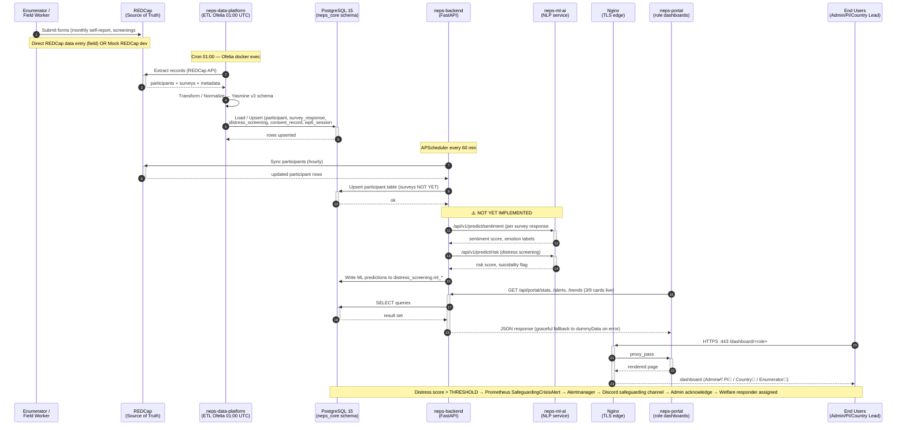

# 06 — Data Flow & System Architecture

**Document Status:** Draft — Ready for Backend Lead Review
**Owner:** Damien + Documentation Lead
**Interview Required:** Backend Lead (to verify and fill gaps)
**Priority:** 2 (Foundational — every other doc references this)

---

## 1. Overview

The NEPS Digital System is a microservices-based research platform for the NEPS longitudinal study across Ghana, Sierra Leone, and Tanzania. It supports participant enrollment, monthly data collection, ML-driven distress screening, safeguarding alerts, and multi-role dashboards for admin/PI/country-lead/enumerator users.

**Source Diagrams (original):** See `NEPSDigSystem-main/Info Files/`:
- `NEPS Digital - information flow diagram.png`
- `NEPS Digital - On-Prem_Deployment diagram.png`
- `NEPS_Digital_HIgh-level-Component.png`

---

## 2. Repositories & Component Map

### 2.1 High-Level Component Diagram

```mermaid
graph TB
    subgraph Users[End Users — Ghana / Sierra Leone / Tanzania]
        E[Enumerator<br/>(field worker)]
        CL[Country Lead]
        PI[Principal Investigator]
        A[Admin / Damien]
    end

    subgraph Edge[Edge / Public Tier]
        N[Nginx<br/>TLS termination<br/>Security headers]
    end

    subgraph Frontend[Presentation Layer]
        P[neps-portal<br/>Next.js 15 · NextAuth<br/>4 role dashboards]
    end

    subgraph Backend[Application Layer]
        B[neps-backend<br/>FastAPI · SQLAlchemy async<br/>Portal + Analytics + Sync routers]
        M[neps-ml-ai<br/>FastAPI · scikit-learn<br/>Sentiment · Emotion · Risk TBD]
    end

    subgraph Data[Data / Integration Layer]
        DP[neps-data-platform<br/>ETL extract→transform→load<br/>Ofelia nightly 01:00]
        R[(REDCap<br/>Forms / Surveys<br/>Source of Truth)]
    end

    subgraph Persistence[Persistence Layer]
        PG[(PostgreSQL 15<br/>neps_core schema<br/>PITR WAL)]
        RD[(Redis<br/>Cache · Circuit-breaker)]
        MO[(MinIO<br/>S3-compatible backup target)]
    end

    subgraph Observability[Monitoring / Observability]
        PR[Prometheus<br/>Metrics · Alert rules]
        GF[Grafana<br/>Dashboards · Logs]
        AM[Alertmanager<br/>Discord routing]
        LK[Loki + Promtail<br/>Log aggregation]
        OF[Ofelia<br/>Cron: ETL + PITR backup]
    end

    subgraph Docs[Documentation]
        D[neps-docs<br/>This repo · 9 documents]
    end

    %% User → Edge → Frontend
    E & CL & PI & A -->|HTTPS :443| N
    N -->|/ route| P

    %% Frontend → Backend
    P -->|/api/* typed apiClient| B
    B -->|ML calls TBD| M

    %% Data layer
    R <-->|REDCap API| DP
    DP -->|Upsert| PG
    B <-->|Read · Write| PG
    B <-->|Cache| RD
    B -->|REDCap proxy| R
    M -->|Predictions → TBD| PG

    %% Backup
    PG -->|WAL + Base backup| MO
    OF -->|cron 01:00| DP
    OF -->|cron 02:00| PG

    %% Observability
    P & B & M & DP & PG & RD -.->|/metrics scraping| PR
    P & B & M & DP & PG -.->|Logs| LK
    PR -->|Alert rules| AM
    AM -->|Safeguarding + infra| DISCORD[/Discord webhook/]
    PR & LK --> GF

    %% Docs reference all
    D -. reference .-> Users & Edge & Frontend & Backend & Data & Persistence & Observability
```

| # | Repository | Technology | Purpose |
|---|------------|-----------|---------|
| 1 | `neps-infrastructure` | Docker Compose, Nginx, Prometheus, Grafana, Alertmanager, Ofelia | Orchestrates all services, networking, monitoring, backups, scheduling |
| 2 | `neps-backend` | FastAPI (Python 3.11), SQLAlchemy async, PostgreSQL, Redis, APScheduler | Core API — Portal endpoints, Analytics endpoints, REDCap sync, auth scaffolding |
| 3 | `neps-portal` | Next.js 15, TypeScript, TailwindCSS, NextAuth.js, Recharts | Web frontend — 4 role-based dashboards |
| 4 | `neps-data-platform` | Python ETL, Alembic, structlog, pandas, SQLAlchemy | REDCap → PostgreSQL ETL pipeline (extract, transform, normalize, load) |
| 5 | `neps-ml-ai` | FastAPI, scikit-learn, NLTK/spaCy, PKL serialised models | NLP service — sentiment, emotion, risk prediction (endpoints TBD) |
| 6 | `neps-docs` | Markdown | Documentation repository (this repo) |

---

## 3. Infrastructure Stack (Docker Compose Services)

All services are defined in `neps-infrastructure/docker-compose.yml` with overlays for prod/staging/discord-alerts.

### 3.1 Networking — 4-Tier Isolation

```mermaid
graph LR
    subgraph HOST[KNUST On-Prem Server Host]
        subgraph PUBLIC[neps-public network]
            direction LR
            N[Nginx :80 :443<br/>Only public ingress]
        end

        subgraph INTERNAL[neps-internal network]
            direction TB
            NP[neps-portal :3000]
            NB[neps-backend :8000]
            NML[neps-ml-ai :8000]
            NDP[neps-data-platform<br/>(no HTTP — exec'd)]
            R[Redis :6379]
            OF[Ofelia scheduler]
            PgA[PgAdmin :80]
            MI[MinIO :9000 :9001]
            BB[Blackbox exporter :9115]
        end

        subgraph MONITORING[neps-monitoring network]
            direction TB
            PR[Prometheus :9090]
            GF[Grafana :3000]
            AM[Alertmanager :9093]
            LK[Loki :3100]
            PT[Promtail<br/>(no port)]
        end

        subgraph DATABASE[neps-database network — fully isolated]
            direction TB
            PG[(PostgreSQL :5432)]
            PE[Postgres exporter :9187]
        end
    end

    %% Internet -> Nginx (only public entrypoint)
    INTERNET([Internet<br/>Field teams / Researchers]) -->|HTTPS 443| N

    %% Nginx proxies to internal
    N -->|proxy_pass| NP
    N -->|proxy_pass /api| NB
    N -->|proxy_pass| GF
    N -->|proxy_pass| PgA

    %% Internal service -> Database (explicit allow-list)
    NB -->|TCP 5432| PG
    NDP -->|TCP 5432| PG
    NML -->|TCP 5432| PG
    PgA -->|TCP 5432| PG
    PE -->|metrics scrape| PG

    %% Internal service -> Redis
    NB --> R

    %% Ofelia schedules ETL + backup
    OF -->|docker exec cron 01:00| NDP
    OF -->|pg_basebackup cron 02:00| PG

    %% Monitoring scrapes everything via host DNS
    PR ---|scrape /metrics| NB & NP & NML & PG & PE & BB
    PR ---|scrape /metrics| R & MI
    PR --> AM
    PT -->|ship container logs| LK
    PR & LK --> GF
    AM -->|webhook| DIS[/Discord/]

    %% Observability shares connection with internal
    INTERNAL <-->|prometheus scrape| MONITORING
```

| Network | Scope | Services Connected |
|---------|-------|-------------------|
| `neps-public` | Public ingress (ports 80/443) | nginx only |
| `neps-internal` | Service-to-service (internal only) | neps-backend, neps-portal, neps-ml-ai, neps-data-platform, redis, ofelia, blackbox-exporter, prometheus, alertmanager, grafana, loki, promtail, pgadmin, minio |
| `neps-database` | Fully isolated DB tier | postgres + postgres-exporter only |
| `neps-monitoring` | Metrics/logging aggregation | prometheus, grafana, alertmanager, loki, exporters |

Only Nginx exposes ports to the host; everything else communicates via internal Docker DNS.

### 3.2 Service Inventory

| Service | Image/Base | Port (internal) | Port (host prod) | Port (host staging) | Purpose |
|---------|-----------|-----------------|------------------|---------------------|---------|
| `postgres` | postgres:15-alpine | 5432 | (not exposed) | 15432 (PgAdmin only) | Primary DB (neps_core schema) |
| `redis` | redis:7-alpine | 6379 | — | — | Session/cache/circuit-breaker state |
| `neps-backend` | python:3.11-alpine | 8000 | — | — | FastAPI application |
| `neps-portal` | node:22-slim | 3000 | — | — | Next.js frontend |
| `neps-ml-ai` | python:3.11-slim | 8000 | — | — | ML prediction service (TBD endpoints) |
| `neps-data-platform` | python:3.11-slim | (no HTTP) | — | — | ETL container (Ofelia exec's into it) |
| `nginx` | nginx:1.27-alpine | 80/443 | 80/443 | 18080/18443 | Reverse proxy + TLS termination |
| `prometheus` | prom/prometheus | 9090 | (restricted) | 19090 | Metrics scraping + alert evaluation |
| `grafana` | grafana/grafana | 3000 | 3001 | 13001 | Dashboards + log viewer |
| `alertmanager` | prom/alertmanager | 9093 | (restricted) | 19093 | Alert routing (Discord webhook) |
| `loki` | grafana/loki | 3100 | — | — | Log aggregation |
| `promtail` | grafana/promtail | — | — | — | Container log shipper → Loki |
| `ofelia` | mcuadros/ofelia | — | — | — | Cron scheduler (ETL sync 01:00, PITR backup 02:00) |
| `pgadmin` | dpage/pgadmin4 | 80 | 5050 | 15050 | DB admin UI |
| `minio` | minio/minio | 9000/9001 | (restricted) | — | S3-compatible object storage (backup target) |
| `postgres-exporter` | prometheuscommunity/postgres-exporter | 9187 | — | — | Postgres metrics → Prometheus |
| `blackbox-exporter` | prom/blackbox-exporter | 9115 | — | — | Uptime probing from user perspective |

### 3.3 Container Hardening

All services run with:
- `no-new-privileges: true` — blocks privilege escalation
- Non-root users where possible (`nextjs` in portal, `neps`/`python` in backend)
- Trivy image scans in CI (portal uses exit-code=1; backend/data-platform need fixing — see readiness review)
- Docker Secrets for all sensitive values (mounted at `/run/secrets/`, not plaintext env vars)

---

## 4. End-to-End Data Flow (REDCap → User)

### 4.0 Data Flow Diagram (Mermaid)



### 4.1 Step-by-Step Data Journey

**Step 1 — Data Enters REDCap**
- Enumerators/field teams collect data via REDCap forms directly, OR
- Mock REDCap service (`neps-data-platform/etl/extract/mock_client.py` / `neps-backend/app/services/redcap_mock.py`) provides realistic synthetic data (150+ participants, 24 months, 3 countries) for dev/test

**Step 2 — ETL Sync (Nightly 01:00 UTC)**
- Ofelia scheduler runs: `docker exec neps-data-platform python -m etl.main sync --full`
- `SyncOrchestrator` in `etl/sync/orchestrator.py` executes:
  1. **Extract** — pulls records from REDCap (production_client.py or mock_client.py) via `REDCAP_API_URL` + token secret
  2. **Transform** — `normalizer.py` + `parser.py` map REDCap field names → normalized schema (Yasmine v3 expanded fields included: employment_status, food_security, socioeconomic, ML score columns)
  3. **Load** — `upsert.py` writes to PostgreSQL `neps_core` schema via `load/db.py`, using Alembic migrations for schema versioning
- Backend also has its own APScheduler hourly sync (`/api/v1/sync/` in `redcap_sync.py`) for participants — currently only participants sync (surveys TBD)

**Step 3 — Data Lives in PostgreSQL `neps_core` Schema**

Tables (from `neps-backend/alembic/versions/a5102354f2c3_initial_schema.py` + v3 expansions):
| Table | Purpose |
|-------|---------|
| `participant` | Core participant record (UUID PK, demographics, site/country, study arm) |
| `consent_record` | Informed consent tracking (date, version, witness, withdrawal flag) |
| `survey_response` | Monthly self-report / intake forms (JSONB for flexible fields) |
| `distress_screening` | PHQ-9 / GAD-7 / suicidality screening results + ML risk scores |
| `referral` | Safeguarding referral tracking (responder assignment, outcomes) |
| `wp6_session` | WP6 intervention session attendance & outcomes |
| *(v3 adds)* | `employment_status`, `food_security`, socioeconomic fields, ML prediction score columns |

**Step 4 — Backend API Serves the Data**
- FastAPI app in `neps-backend/main.py` wires 5 routers:
  - `/health` — service health checks
  - `/api/portal/*` — 20+ endpoints for dashboard cards (stats, participants, alerts, trends, WP6, referrals, country/site breakdowns)
  - `/api/v1/analytics/*` — cohort overview, distress trends, WP6 outcomes, survey completion, retention, multi-axis disaggregation
  - `/api/v1/sync/*` — REDCap sync trigger, status, manual run
  - `/redcap` / `/api/v1/redcap/*` — REDCap proxy + mock endpoints

**Step 5 — Portal Consumes Backend via `apiClient`**
- `neps-portal/app/lib/api.ts` — typed API client matching backend response schemas
- 3 admin dashboard cards currently live: `getPortalStats()`, `getDistressTrends()`, `getDistressAlerts()` with graceful fallback to `dummyData.tsx`
- Remaining 6 admin cards + 3 role dashboards use placeholder data (see readiness review "Partial Dev")

**Step 6 — ML Layer (Not Yet Wired)**
- `neps-ml-ai/models/` has trained PKL files: sentiment 5-tier classifier + vectorizer + pipeline; emotion multi-label model + vectorizer + pipeline
- FastAPI in `neps-ml-ai/main.py` currently exposes only `/` and `/health` — **zero prediction endpoints implemented**
- `neps-backend/app/api/v1/risk_models.py` is **0 bytes**
- Flow will be: backend `risk_models.py` calls neps-ml-ai `/api/v1/predict/*` → stores predictions in `distress_screening.ml_*` columns → distress alerts fire via Prometheus rules → Alertmanager → Discord safeguarding channel

---

## 5. Monitoring & Observability Flow

### 5.0 Observability Flow Diagram (Mermaid)

```mermaid
flowchart LR
    subgraph Apps[Application / Service Layers]
        direction TB
        NP[neps-portal<br/>/api/metrics]
        NB[neps-backend<br/>/metrics via instrumentator]
        NML[neps-ml-ai<br/>/metrics]
        ETC[...]
    end

    subgraph DB[Data Layer]
        PG[(PostgreSQL)]
        PE[postgres-exporter]
    end

    subgraph HOST[Host / Infra]
        BB[blackbox-exporter<br/>HTTP/TCP uptime probes]
    end

    subgraph Scrapers[Prometheus Pull Model — every 15s]
        PR[(Prometheus TSDB)]
    end

    subgraph Alerting[Alert Pipeline]
        AR[Alert Rules<br/>neps-alerts.yml]
        AM[Alertmanager]
        DISC{Discord Channels}
        PRODCH[#safeguarding-alerts<br/>prod]
        STGCH[#staging-alerts<br/>staging test]
    end

    subgraph Viz[Visualization]
        GF[Grafana<br/>port 3001 / staging 13001]
        D1[Dashboard:<br/>neps-overview.json]
    end

    subgraph Logs[Log Aggregation]
        CT[Container stdout/stderr<br/>all services]
        PT[Promtail<br/>log shipper]
        LK[(Loki<br/>log TSDB)]
    end

    %% App metrics scraped
    Apps -- /metrics scrape --> PR

    %% Postgres scraped via exporter
    PG --> PE
    PE -- postgres-specific metrics --> PR

    %% Blackbox probes
    BB -- probe result metrics --> PR

    %% Alerts evaluation
    PR -->|evaluate| AR
    AR -->|firing alerts| AM

    %% Alert routing (by compose project name)
    AM -->|Prod| DISC
    DISC --> PRODCH
    AM -->|Staging| DISC
    DISC --> STGCH

    %% Note: HIGH gap per review — only Discord route, no Slack/email/SMS fallback
    Note over AM,PRODCH: ⚠ HIGH — Add Slack/email/SMS fallback<br/>before production

    %% Grafana datasources
    PR -->|metrics query| GF
    LK -->|logs query| GF
    GF --- D1

    %% Log flow
    CT -->|scrape all containers| PT
    PT -->|push logs| LK
```

---

### 5.1 Key Alert Rules (from `monitoring/rules/neps-alerts.yml`)
| Alert | Severity | Trigger |
|-------|----------|---------|
| ServiceDown | Critical | Any service `/health` fails >2m |
| HighErrorRate | Critical | 5xx rate >5% for 5m |
| PostgreSQLDown | Critical | postgres-exporter down |
| PostgreSQLOverloaded | Warning | Connections >80% max for 10m |
| DiskAlmostFull / MemoryAlmostFull / CPUAlmostFull | Warning | >85% for 5m |
| SafeguardingCrisisAlert | **P0 Critical** | Distress score above suicidality threshold detected |
| REDCapSyncStaleness | Warning | Last sync >25h ago |
| ETLJobFailure | Warning | ETL container non-zero exit on last run |
| DataQualityScoreLow | Warning | ETL data quality metric below threshold *(not yet published)* |

---

## 6. Authentication & RBAC (Current State)

**Status: NOT END-TO-END IMPLEMENTED** (Cross-cutting CRITICAL)

| Layer | What Exists | What's Missing |
|-------|------------|----------------|
| Portal (NextAuth.js) | `auth.ts` has JWT session, role injection, role-based routing; but **3 hardcoded in-memory users** (enumerator/country-lead/admin) with `password123` | No PI role mock; no real backend auth call; all creds are fake |
| Backend (JWT) | `app/core/security.py` defines `create_access_token`, `get_current_user` with OAuth2PasswordBearer scheme; JWT signing via secret | **No User DB model**, **no `/api/auth/login` endpoint**, **zero routes use `Depends(get_current_user)`** — entire API is public |

**Target state (from documentation plan):**
- `/api/auth/login` validates creds → returns JWT access token
- User DB model with RBAC roles: `admin | pi | enumerator | country_lead`
- All non-public routes guarded by `Depends(get_current_user)` + role-check dependency
- Portal NextAuth calls real `/api/auth/login` instead of in-memory list

---

## 7. Backup & Disaster Recovery

### 7.1 PostgreSQL PITR (Point-in-Time Recovery)
- **WAL archiving**: PostgreSQL streams WAL files to `/backup/pitr/wal/` every 60s via `archive_command`
- **Base backups**: `backup-pitr.sh` runs daily 02:00 via Ofelia; creates compressed tarball, cleans >30-day-old backups
- **Restore**: `pitr-restore.sh "2026-05-27 14:30:15"` restores to any precise second
- **Drill testing**: `pitr-drill.sh` restores to isolated temporary PG on alternate port (no prod touch)

### 7.2 Rollback
- `rollback.sh` reads `.deployment-history`, pulls prior GHCR image SHAs, applies `docker-compose.rollback.yml` overlay
- Supports `./rollback.sh previous` or `./rollback.sh specific-sha <sha>`
- Runs `/health` polling after rollback; declares success only when all APIs respond

### 7.3 RTO / RPO (from diagram — needs formal confirmation)
- **RTO**: 24–48 hours
- **RPO**: 24 hours

---

## 8. CI/CD Pipeline Flow

```
feature/X branch
     │
     ▼
Push / PR to any branch
     │
     ▼
GitHub Actions (each repo has ci-cd.yml)
  ├─ validate: lint, typecheck, unit tests
  ├─ build: Docker image build
  ├─ security: Trivy CVE scan
  │     └─ portal: exit-code=1 (fails on HIGH/CRITICAL)
  │     └─ backend/data: exit-code=0 (NEEDS FIX — see review line 86)
  ├─ (if push to staging branch AND STAGING_DEPLOY_HOST set)
  │     └─ deploy-staging: ssh to staging VM → docker compose pull + up -d
  └─ (if push to main AND DEPLOY_HOST set)
        └─ deploy: ssh to prod VM → docker compose pull + up -d
```

### 8.1 Container Registry
- GitHub Container Registry (GHCR): `ghcr.io/nepsdigitalsystem/<repo>:<tag>`
- Auth via `GHCR_PAT` org-wide secret in each repo

---

## 9. Staging Environment Isolation

(Implemented 2026-09-11 — see `docker-compose.staging.yml`)

| Isolation Mechanism | Production | Staging |
|---------------------|-----------|---------|
| `COMPOSE_PROJECT_NAME` | *(none / default)* | `neps-staging` |
| Nginx HTTP/HTTPS | `:80 / :443` | `:18080 / :18443` |
| All other services | standard ports | +10,000 offset (e.g. backend 18000, Grafana 13001, Prom 19090, PgAdmin 15050, Postgres 15432) |
| Data volumes | `postgres-data` etc. | `postgres-data-staging`, `wal-archive-staging`, etc. |
| Alert routing | Discord safeguarding channel | `#staging-alerts` test channel + daily 10:00 UTC synthetic smoke test |
| Ofelia container lookups | standard names | namespaced names (`neps-staging-neps-data-platform-1`) |
| HTTP response headers | *(standard)* | `X-NEPS-Environment: staging`, `X-Robots-Tag: noindex` |

---

## 10. Physical Deployment & Hosting

| Item | Value (from planning; confirm with Damien / KNUST IT) |
|------|------------------------------------------------------|
| Production host | KNUST on-premise server *(provisioning TBD — `DEPLOY_HOST` vars not yet set in GitHub)* |
| Staging host | Option A: same host side-by-side (staging overlay + port shift); Option B: dedicated 2nd KNUST VM *(provisioning TBD)* |
| Sierra Leone / Tanzania access | HTTPS over public internet to KNUST server (no VPN — portal is a standard HTTPS web app) |
| Ghana on-campus access | Same HTTPS endpoint |
| Field enumerator access | HTTPS via mobile data / school Wi-Fi (PWA/offline support TBD) |
| Physical storage country | Ghana (KNUST) |
| Cloud usage | None currently; all on-prem (GHCR only for container images, not data) |

---

## Information Gathering Checklist

- [x] Damien provided architecture stack, data flow, monitoring, DR, CI/CD, staging details
- [ ] Backend Lead interview scheduled to verify API router inventory and confirm ML integration target design
- [ ] Backend Lead confirms REDCap sync split (data-platform nightly vs backend hourly)
- [ ] Backend Lead confirms PostgreSQL table inventory matches production schema
- [ ] Backend Lead review signed off
- [ ] Dr. Linda confirms hosting location / data residency requirements for IRB
